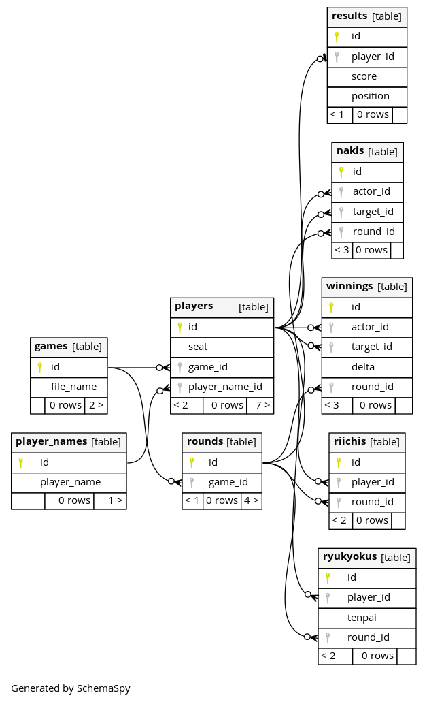

# Mjai Recoder
Mjaiイベントログ管理ツール

## 機能
- Mjaiサーバー(ポート番号: 11600)
- DBサーバー(ポート番号: 5432)
- ログ閲覧(ポート番号: 8000)

## ER図


### 出力コマンド
```shell
$ docker run -v "$PWD/output:/output" -v "$PWD/schemaspy.properties:/schemaspy.properties" --net=host --rm schemaspy/schemaspy
```

## 解析

*Player*の成績
```
$ ./analyze.sh Player
```

## SQLコマンド実行

```
$ docker exec -it mjai-recoder_db_1 psql mjai_db -U user
```
